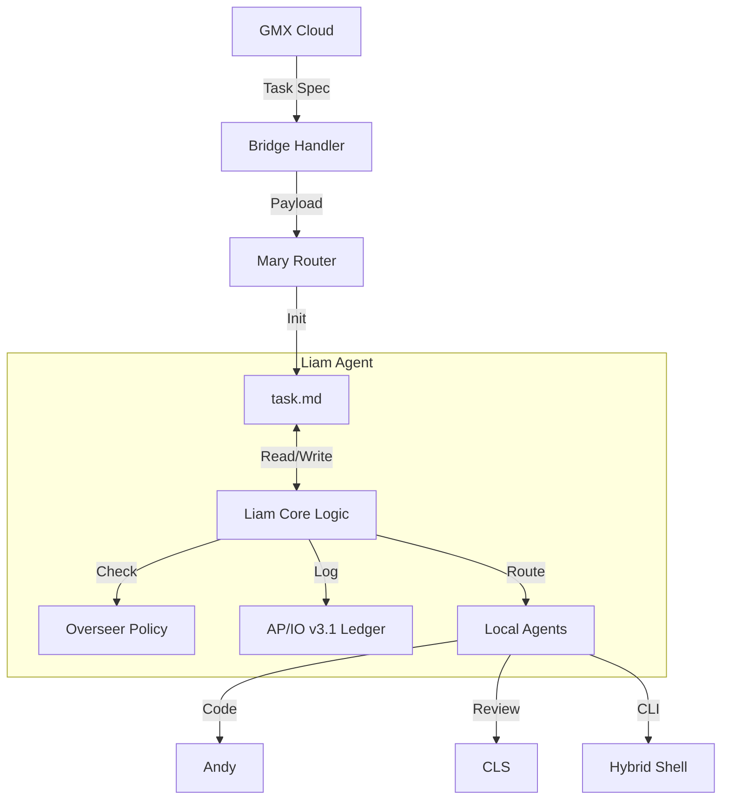

# Liam Refactor Plan: Antigravity Agent Mode

**Goal**: Refactor Liam's architecture to align with "Antigravity" agentic patterns (stateful execution, artifact-driven memory, structured task boundaries) while maintaining strict 02LUKA governance.

## 1. High-Level Design

Liam will evolve from a passive router to a **Stateful Local Orchestrator**.

- **Core Loop**: `Wake -> Read State (task.md) -> Execute Step -> Update State -> Sleep/Notify`.
- **Memory**:
  - `task.md`: The source of truth for current progress.
  - `implementation_plan.md`: The design doc for active changes.
  - `AUDIT_REPORT.md` / `walkthrough.md`: Verification artifacts.
- **Execution Engine**:
  - **Mary Router (`mary_router.py`)**: Becomes the *Input Processor* that initializes the state.
  - **Liam Core**: A new loop (conceptually) that drives the `task.md` checklist.
  - **Antigravity Bridge**: Explicit compatibility with the Antigravity system prompts (using `task_boundary`, `notify_user`).

## 2. Module Dependencies

- **`mary_router.py`**: Refactored to *create/update* `task.md` instead of just returning a dict.
- **`overseer`**: Strictly enforced for every state transition.
- **`ap_io_v31`**: The logging layer for every tool call / step.

## 3. Queue Interactions

Liam does not maintain a persistent background process (daemon) but reacts to events.

1.  **Inbound (GMX/User)**:
    - Trigger: `dispatch_to_bridge.py` or User Chat.
    - Action: Liam parses intent -> Creates `task.md` entry -> Sets mode to `PLANNING`.
2.  **Processing (Antigravity Loop)**:
    - Liam picks up the active task in `task.md`.
    - Executes tool calls.
    - Updates `task.md` status.
3.  **Outbound (Delegation)**:
    - If task requires Andy/CLS: Liam writes `PR_CONTRACT` -> Notifies User/System to switch context.
    - If task requires CLI: Liam calls `run_command` (Hybrid).

## 4. Review Checkpoints

- **Plan Approval**: Before moving from `PLANNING` to `EXECUTION`, Liam MUST request user review of `implementation_plan.md`.
- **Critical Actions**: Any `run_command` or file delete in `governance` (if ever allowed) triggers a `notify_user` block.
- **Completion**: `walkthrough.md` must be generated and reviewed before marking the root task as `[x]`.

## 5. Risk Analysis

| Risk | Impact | Mitigation |
| :--- | :--- | :--- |
| **State Desync** | `task.md` says one thing, code says another. | **Rule**: `task.md` is updated *after* successful tool execution, not before. |
| **Governance Violation** | Liam edits SOT files. | **Guardrail**: `mary_router` enforces `overseer` checks on *every* file target. |
| **Infinite Loop** | Liam keeps trying to fix a failing test. | **Limit**: Max retry count (3) per sub-task. Then escalate to User. |
| **AP/IO Silence** | Actions happen without logs. | **Enforcement**: Wrapper around all tool calls to auto-log to `ap_io_v31`. |

## 6. Next Steps (Implementation)

1.  **Refactor `mary_router.py`**: Add `init_task_state(spec)` function.
2.  **Create `LiamAgent` Class**: A Python wrapper to manage the `task.md` lifecycle programmatically (if needed for automation) or just define the prompts/SOPs for the AI.
3.  **Implement AP/IO Wrappers**: Ensure `write_ledger_entry` is called.
