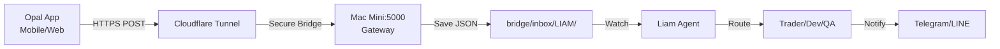

# ✅ Opal Gateway - Implementation Complete

## 🎉 Part 1 & 2 Status: READY

### 📦 What's Been Created

```
apps/opal_gateway/
├── gateway.py              ✅ Main Flask server
├── requirements.txt        ✅ Python dependencies (installed)
├── start_gateway.sh        ✅ Startup script (executable)
├── test_gateway.py         ✅ Test suite
├── README.md               ✅ Technical documentation
├── OPAL_CONFIG.md          ✅ Opal App configuration guide
└── .venv/                  ✅ Virtual environment (ready)
```

---

## 🚀 Quick Start (3 Steps)

### Step 1: Start the Gateway

```bash
cd ~/02luka/apps/opal_gateway
./start_gateway.sh
```

Server will start on `http://localhost:5000`

### Step 2: Test It

**In a new terminal:**

```bash
# Method A: Use the test script
cd ~/02luka/apps/opal_gateway
source .venv/bin/activate
python test_gateway.py

# Method B: Quick curl test
curl http://localhost:5000/ping
```

Expected response:
```json
{"status":"ok","timestamp":"2025-12-05T04:30:00.123Z"}
```

### Step 3: Configure Cloudflare Tunnel

**Option A: Add to existing tunnel config**

Edit `~/.cloudflared/config.yml`:

```yaml
ingress:
  - hostname: gateway.theedges.work
    service: http://localhost:5000
  # ... other existing rules ...
  - service: http_status:404
```

Then:
```bash
cloudflared tunnel route dns YOUR_TUNNEL_NAME gateway.theedges.work
sudo launchctl stop com.cloudflare.cloudflared
sudo launchctl start com.cloudflare.cloudflared
```

**Option B: Quick test tunnel**

```bash
cloudflared tunnel --url http://localhost:5000
```

This gives a temporary URL for testing.

---

## 📱 Opal App Configuration

See full guide in: [`OPAL_CONFIG.md`](file:///Users/icmini/02luka/apps/opal_gateway/OPAL_CONFIG.md)

### Quick Summary:

1. **Add Webhook Node** in your Opal flow after "Generate JSON Work Order"
   - Method: `POST`
   - URL: `https://gateway.theedges.work/api/wo`
   - Header: `X-Relay-Key: YOUR_KEY` (get from `.env.local`)
   - Body: `{{GenerateJSONWorkOrder.output}}`

2. **Update JSON Generator Prompt**
   - Copy the updated prompt from `OPAL_CONFIG.md`
   - Supports: Trade, Expense, GuiAuto, Progress, DevTask, Estimation
   - Includes notification flags (Telegram, LINE)

3. **Test End-to-End**
   - Submit test work order from Opal
   - Check `~/02luka/bridge/inbox/LIAM/` for JSON file
   - Verify agents pick it up

---

## 🔐 Security Setup

**Get your RELAY_KEY:**

```bash
grep RELAY_KEY ~/02luka/.env.local
```

This key must be:
1. Added to Opal as `X-Relay-Key` header
2. Present in `.env.local` for gateway validation

---

## 🧪 Testing Checklist

- [ ] Gateway starts without errors
- [ ] `GET /ping` returns 200 OK
- [ ] `POST /api/wo` accepts test work order
- [ ] JSON file appears in `bridge/inbox/LIAM/`
- [ ] Cloudflare Tunnel routes traffic correctly
- [ ] Opal webhook receives 200 response
- [ ] End-to-end: Opal → Gateway → Bridge → Agents

---

## 📊 Architecture Flow



---

## 🎯 Supported Work Order Types

| App Mode | Execution Mode | Target Agent | Features |
|----------|----------------|--------------|----------|
| **Trade** | `trade_analysis` | Trader | Chart analysis, FastVLM, Market signals |
| **Expense** | `none` | Finance | Receipt tracking, Budget logging |
| **GuiAuto** | `gui_automation` | Hybrid Agent | App control, Mouse/Keyboard |
| **Progress** | `none` | Project Manager | Site photos, Status updates |
| **DevTask** | `atg_pipeline` | Dev (Antigravity) | Code tasks, Debugging |
| **Estimation** | `none` | Estimator | Cost analysis, Planning |

---

## 📂 Key Files Reference

| File | Purpose |
|------|---------|
| [`gateway.py`](file:///Users/icmini/02luka/apps/opal_gateway/gateway.py) | Main server code |
| [`OPAL_CONFIG.md`](file:///Users/icmini/02luka/apps/opal_gateway/OPAL_CONFIG.md) | Opal webhook setup guide |
| [`README.md`](file:///Users/icmini/02luka/apps/opal_gateway/README.md) | Technical documentation |
| [`test_gateway.py`](file:///Users/icmini/02luka/apps/opal_gateway/test_gateway.py) | Automated tests |

---

## 🔄 Next Steps

1. **Start Gateway**: `./start_gateway.sh`
2. **Run Tests**: `python test_gateway.py`
3. **Configure Tunnel**: Add to Cloudflare config
4. **Update Opal**: Add webhook node + updated prompt
5. **Submit Test WO**: From Opal app
6. **Verify Processing**: Check bridge inbox & agent logs
7. **Production**: Set up as LaunchAgent (optional)

---

## 🐛 Troubleshooting

**Gateway won't start:**
```bash
# Check port 5000
lsof -i :5000

# Kill if occupied
kill -9 $(lsof -t -i :5000)

# Restart
./start_gateway.sh
```

**401 Unauthorized:**
```bash
# Verify relay key matches
grep RELAY_KEY ~/02luka/.env.local

# Update Opal X-Relay-Key header
```

**Work orders not appearing:**
```bash
# Check inbox
ls -lha ~/02luka/bridge/inbox/LIAM/

# Check gateway logs
# (logs will be in terminal if running in foreground)
```

---

## 📞 Support

- 📄 Technical Docs: `README.md`
- ⚙️ Opal Setup: `OPAL_CONFIG.md`
- 🧪 Testing: `python test_gateway.py`
- 📊 Gateway Stats: `curl http://localhost:5000/stats`

---

**Status:** ✅ **READY FOR TESTING**  
**Version:** 1.0.0  
**Created:** 2025-12-05  
**Liam Route:** Non-locked zone → CLS-capable implementation complete
