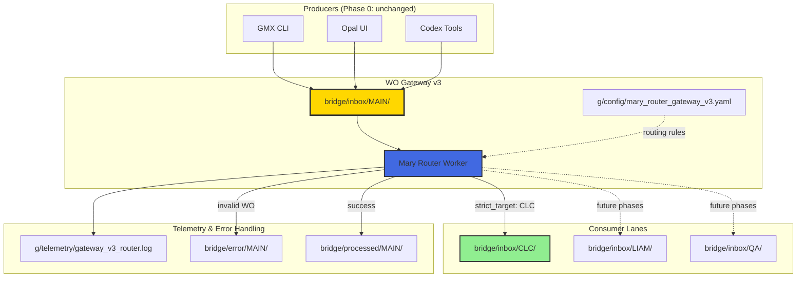

# WO Gateway v3 — Specification (Phase 0)

**Feature ID:** `wo_gateway_v3`  
**Phase:** 0 (Proof of Concept — MAIN → CLC routing only)  
**Status:** Draft  
**Created:** 2025-12-06  
**Author:** GMX (Architect Mode)  
**Governance:** AI:OP-001 Compliant

---

## Executive Summary

WO Gateway v3 introduces a **centralized Work Order routing architecture** that replaces the current distributed inbox model (where each agent has its own inbox) with a **single point of entry** (`bridge/inbox/MAIN/`) and an **intelligent router** (Mary Router) that dispatches WOs to the appropriate agent lanes based on declarative routing metadata.

### Current State Problems
1. **Scattered WO Creation**: Multiple producers (GG, Opal, GMX CLI, Codex) write directly to agent-specific inboxes
2. **No Central Visibility**: No single point to observe all incoming work
3. **Tight Coupling**: Producers must know exact target agent inbox paths
4. **Difficult to Extend**: Adding new routing logic requires changing multiple producers

### Target State (Phase 0)
- **Single Entry Point**: All WOs → `bridge/inbox/MAIN/`
- **Intelligent Router**: Mary Router worker watches MAIN, routes to destinations
- **Declarative Routing**: WOs declare `strict_target` or `routing_hint`, router decides
- **Observability**: Central telemetry for all WO ingestion and routing

---

## Architecture Overview



---

## Component Specifications

### 1. Central Inbox: `bridge/inbox/MAIN/`

**Purpose**: Single entry point for all Work Orders

**Location**: `bridge/inbox/MAIN/`

**Access Pattern**:
- **Writers**: All WO producers (write-only)
- **Readers**: Mary Router only (exclusive ownership)

**File Format**: `*.yaml` (WO v3 schema)

**Lifecycle**:
1. Producer writes `WO-<ID>.yaml` to MAIN
2. Mary Router detects file (inotify or polling)
3. Mary Router validates, routes, and moves file
4. Original file moved to `bridge/processed/MAIN/` or `bridge/error/MAIN/`

---

### 2. Mary Router Worker

**Module**: `agents/mary_router/gateway_v3_router.py`

**Responsibilities**:
- Watch `bridge/inbox/MAIN/` for new `*.yaml` files
- Parse and validate WO YAML against schema
- Determine routing destination using:
  1. `strict_target` (highest priority)
  2. `routing_hint` (fallback heuristic)
  3. Default rules from config
- Move WO to destination inbox
- Log telemetry event
- Handle errors gracefully

**Runtime**:
- Long-running daemon process
- Managed by LaunchAgent: `com.02luka.mary-gateway-v3.plist`
- `RunAtLoad: true`, `KeepAlive: true`

**Configuration**: `g/config/mary_router_gateway_v3.yaml`

**Phase 0 Routing Logic**:
```python
if wo.get("strict_target") == "CLC":
    destination = "bridge/inbox/CLC/"
else:
    # Phase 0: reject non-CLC targets
    log_error("Phase 0 only supports CLC routing")
    move_to_error()
```

**Error Handling**:
- Invalid YAML → move to `bridge/error/MAIN/` with `.error.log` file
- Unknown target → move to `bridge/error/MAIN/` with reason
- File I/O errors → retry with exponential backoff, then error queue

**Telemetry Schema**:
```json
{
  "timestamp": "2025-12-06T17:45:30+07:00",
  "event": "wo_routed",
  "wo_id": "WO-20251206-TEST-001",
  "source": "MAIN",
  "destination": "CLC",
  "strict_target": "CLC",
  "routing_hint": "dev_oss",
  "duration_ms": 45
}
```

---

### 3. Work Order Schema v3

**Backward Compatibility**: ✅ Superset of WO v2 (all v2 fields still valid)

**Required Fields** (v2 compatible):
- `wo_id`: Unique identifier (format: `WO-YYYYMMDD-<NAME>-<SUFFIX>`)
- `title`: Human-readable title
- `strict_target`: Target agent (`CLC`, `LIAM`, `QA`, etc.)
- `status`: Lifecycle state (`pending`, `in_progress`, `completed`, `failed`)
- `priority`: `P0` (critical) to `P3` (low)

**New Optional Fields** (v3 additions):
- `entry_channel`: Where WO originated (`gmx_cli`, `opal_ui`, `codex`, `manual`)
- `created_by`: Creator identifier
- `source`: Source system or script
- `routing_hint`: Secondary routing signal (e.g., `dev_oss`, `dev_lac`)

**Example v3 WO**:
```yaml
wo_id: "WO-20251206-EXAMPLE-001"
title: "Example gateway v3 work order"
strict_target: "CLC"
routing_hint: "dev_oss"
priority: "P1"
status: "pending"
entry_channel: "gmx_cli"
created_by: "gmx"

objective: |
  Example objective text

scope:
  include:
    - "path/to/files/**"
  exclude:
    - "tests/**"

tasks:
  - id: "T1"
    desc: "Task description"
    steps:
      - "Step 1"
      - "Step 2"

acceptance_criteria:
  - "Criteria 1"
  - "Criteria 2"

outputs:
  - "Expected deliverable 1"
```

---

## Directory Structure

```
02luka/
├── agents/
│   └── mary_router/
│       ├── gateway_v3_router.py       # NEW: Router worker
│       ├── config.py                  # NEW: Config loader
│       └── telemetry.py               # NEW: Telemetry helpers
│
├── bridge/
│   ├── inbox/
│   │   ├── MAIN/                      # NEW: Central inbox
│   │   ├── CLC/                       # Existing
│   │   ├── LIAM/                      # Existing (unused in Phase 0)
│   │   └── QA/                        # Existing (unused in Phase 0)
│   ├── processed/
│   │   └── MAIN/                      # NEW: Successfully routed WOs
│   └── error/
│       └── MAIN/                      # NEW: Failed routing attempts
│
├── g/
│   ├── config/
│   │   └── mary_router_gateway_v3.yaml  # NEW: Router configuration
│   ├── telemetry/
│   │   └── gateway_v3_router.log      # NEW: Router telemetry
│   └── reports/
│       └── feature-dev/
│           └── wo_gateway_v3/
│               ├── SPEC.md            # This document
│               ├── PLAN.md            # Implementation plan
│               └── gateway_v3_wo_schema_20251206.md  # Schema docs
│
└── ~/Library/LaunchAgents/
    └── com.02luka.mary-gateway-v3.plist  # NEW: LaunchAgent
```

---

## Phase 0 Constraints

> [!IMPORTANT]
> Phase 0 is a **proof of concept** with deliberately limited scope:

### In Scope
✅ Create `bridge/inbox/MAIN/` directory  
✅ Implement Mary Router worker (MAIN → CLC only)  
✅ WO schema v3 documentation  
✅ LaunchAgent for Mary Router  
✅ Telemetry logging  
✅ Error handling and processed archive  
✅ End-to-end validation with test WO  

### Out of Scope (Future Phases)
❌ Migrating producers (GG, Opal, Codex) to use MAIN  
❌ Routing to LIAM, QA, or other lanes  
❌ Dashboard/UI integration  
❌ Advanced routing rules (priority-based, load balancing)  
❌ Status tracking API  
❌ Removing old agent inboxes  

### Non-Goals
- **Do NOT** remove or disable existing LaunchAgents (CLC, Liam, etc.)
- **Do NOT** break existing WO v2 workflows
- **Do NOT** require all producers to migrate immediately

---

## Success Criteria

### Phase 0 Complete When:
1. ✅ `bridge/inbox/MAIN/` exists and is monitored
2. ✅ Mary Router worker runs via LaunchAgent
3. ✅ Test WO placed in MAIN is successfully routed to CLC
4. ✅ Telemetry log shows routing event
5. ✅ Original WO moved to `bridge/processed/MAIN/`
6. ✅ Schema documentation published
7. ✅ Validation report created

### Acceptance Test
```bash
# 1. Place test WO in MAIN
cat << EOF > ~/02luka/bridge/inbox/MAIN/WO-TEST-GATEWAY-V3.yaml
wo_id: "WO-TEST-GATEWAY-V3"
title: "Gateway v3 validation test"
strict_target: "CLC"
priority: "P2"
status: "pending"
objective: "Validate MAIN → CLC routing"
EOF

# 2. Wait for Mary Router (or trigger manually)
sleep 5

# 3. Verify WO moved to CLC inbox
test -f ~/02luka/bridge/inbox/CLC/WO-TEST-GATEWAY-V3.yaml && echo "✅ Routing successful"

# 4. Check telemetry
grep "WO-TEST-GATEWAY-V3" ~/02luka/g/telemetry/gateway_v3_router.log

# 5. Verify processed archive
test -f ~/02luka/bridge/processed/MAIN/WO-TEST-GATEWAY-V3.yaml && echo "✅ Archival successful"
```

---

## Risk Assessment

| Risk | Severity | Mitigation |
|------|----------|------------|
| Mary Router crashes/hangs | High | LaunchAgent KeepAlive + error telemetry |
| File conflicts (concurrent writes) | Medium | Atomic file operations + unique filenames |
| YAML parsing errors | Medium | Strict validation + error queue |
| LaunchAgent permission issues | Low | Standard 02luka LaunchAgent pattern |
| Disk I/O bottlenecks | Low | Phase 0 volume is minimal |

---

## Future Phases (Roadmap)

### Phase 1: Multi-Lane Routing
- Add support for `LIAM`, `QA`, `DEV_LAC_MANAGER` targets
- Implement routing rule engine from config
- Add priority-based queuing

### Phase 2: Producer Migration
- Migrate GMX CLI to write to MAIN
- Update Opal UI to use MAIN
- Migrate all g/tools scripts
- Deprecate direct inbox writes

### Phase 3: Observability & Control Plane
- Create WO status API (for dashboard/UI)
- Add Telegram bot integration
- Implement WO search and history
- Add retry and requeue mechanisms

### Phase 4: Advanced Features
- Load balancing across multiple workers
- Intelligent routing based on system load
- WO dependency graphs
- Auto-scaling based on queue depth

---

## Dependencies

### Required Components (must exist)
- `bridge/inbox/CLC/` (existing CLC lane)
- CLC executor (to consume routed WOs)
- Standard 02luka telemetry infrastructure

### Optional Components
- `g/config/` directory structure
- Logger/telemetry aggregation (for centralized logs)

---

## Compliance & Governance

### AI:OP-001 Alignment
- ✅ **Vendor Agnostic**: No dependency on specific AI provider
- ✅ **Observable**: Full telemetry logging
- ✅ **Safe**: Graceful error handling, no data loss
- ✅ **Maintainable**: Clear separation of concerns
- ✅ **Documented**: Complete SPEC + PLAN

### Zone Definitions (v4.1)
- `agents/mary_router/` → Core system agent (Governance Zone)
- `bridge/inbox/` → Core infrastructure (Governance Zone)
- `g/config/` → Configuration (Governance Zone)
- `g/telemetry/` → Observability (Data Zone)

---

## Open Questions

> [!NOTE]
> Questions for Boss/CLC:

1. **Polling Interval**: Should Mary Router use inotify/fswatch or simple polling? (Recommend: polling with 2-5 sec interval for Phase 0 simplicity)

2. **Error Retention**: How long should files in `bridge/error/MAIN/` be retained before cleanup?

3. **Telemetry Format**: Use structured JSON logs or plain text? (Recommend: JSON for easier aggregation)

4. **Config Format**: YAML vs JSON for `mary_router_gateway_v3.yaml`? (Recommend: YAML for readability)

---

## References

- **Related Conversations**:
  - WO Bridge v2.7 (AI:OP-001 compliant foundation)
  - LAC v4 Rollout (agent routing patterns)
  - Telemetry Aggregation (observability standards)

- **Related Documents**:
  - `g/governance/zone_definitions_v41.yaml`
  - `g/governance/AI_OP_001.md`
  - Auto WO Bridge v2.7 implementation

---

**Document Status**: 📋 Ready for Review  
**Next Step**: Create `PLAN.md` and dispatch to CLC for implementation
