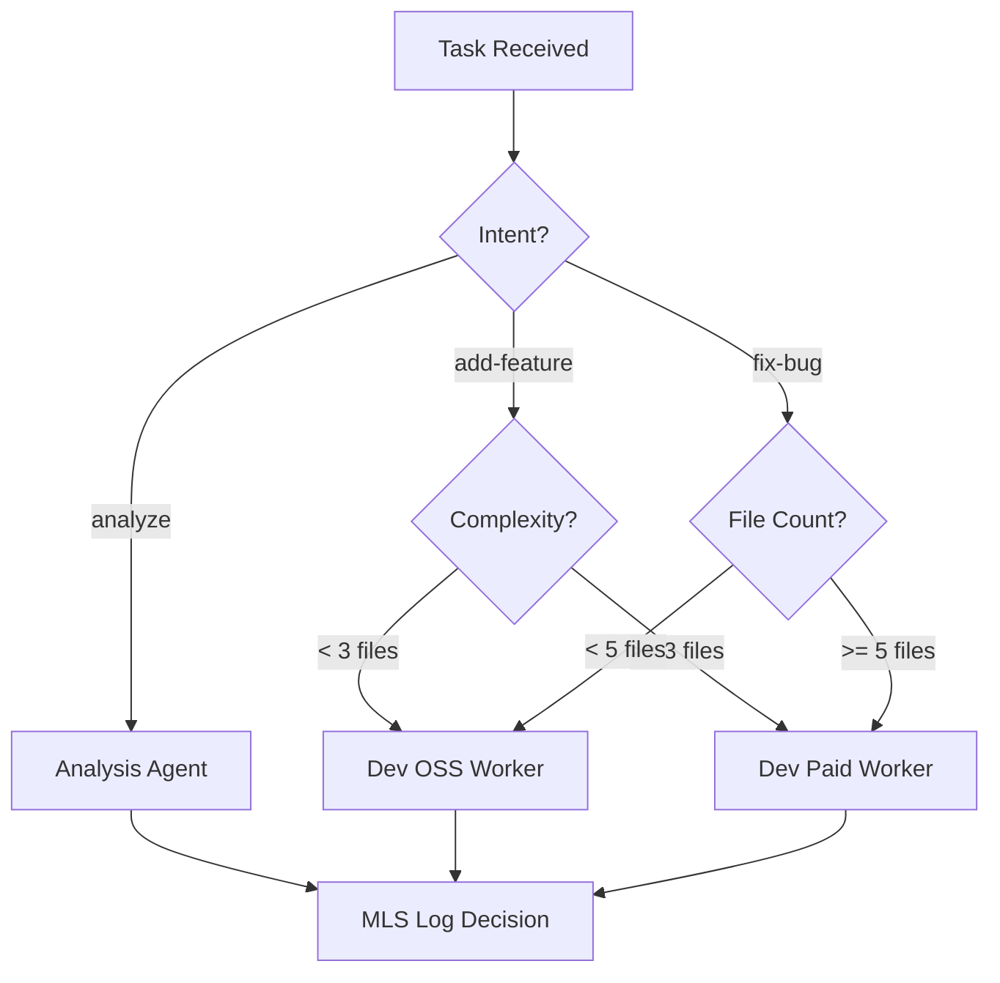

# MLS Trigger Layer v1.0 - Phase 4: Orchestrator Blueprint

**Version**: 0.1 (Design Only)  
**Date**: 2025-12-03  
**Status**: Architectural Specification  
**Author**: GMX + GG

---

## 1. Executive Summary

**Purpose**: Define the architectural contract between MLS Trigger Layer and the GG/GC Orchestrator system to enable automatic MLS logging of all orchestrator-level operations.

**Scope**: Pure design specification. No implementation. No code changes.

**Goal**: Prevent architecture collision when Phase 4 v2 is implemented by establishing clear contracts, boundaries, and integration points now.

---

## 2. GG/GC Unified Architecture Layer

### 2.1 Current State (As-Is)

**GG (Global Manager)**: Orchestrates cross-agent workflows
- Current Location: Unknown (not found in codebase during Phase 1-3)
- Expected Role: Task routing, agent selection, workflow orchestration
- Integration Point: Needed but undefined

**GC (Governance Controller)**: Enforces governance rules
- Current Location: Unknown
- Expected Role: Policy enforcement, compliance checks, audit logging
- Integration Point: Needed but undefined

**Gap**: No unified orchestrator interface exists in current codebase.

### 2.2 Future State (To-Be)

**Unified Orchestrator Interface**:
```python
# g/orchestrator/interface.py (future)
class OrchestratorInterface:
    """
    Unified interface for GG/GC orchestration.
    MLS Trigger Layer hooks into this interface.
    """
    
    def route_task(self, task: Task) -> Agent:
        """Route task to appropriate agent."""
        pass
    
    def enforce_policy(self, task: Task) -> PolicyDecision:
        """Enforce governance policies."""
        pass
    
    def arbitrate_conflict(self, agents: List[Agent]) -> Agent:
        """Arbitrate when multiple agents claim a task."""
        pass
    
    def inject_context(self, task: Task) -> Task:
        """Inject context from memory/RAG into task."""
        pass
```

**MLS Integration Point**:
```python
# Phase 4 v2 Implementation (future)
from g.tools.mls_log import mls_log

class OrchestratorWithMLS(OrchestratorInterface):
    def route_task(self, task: Task) -> Agent:
        result = super().route_task(task)
        
        # MLS logging (async, after routing)
        mls_log(
            "solution",
            f"Orchestrator: Routed {task.id} to {result.name}",
            f"Task: {task.objective}, Agent: {result.name}",
            "orchestrator",
            state={"task_id": task.id, "agent": result.name},
            tags=["orchestrator", "routing"],
            confidence=1.0
        )
        
        return result
```

---

## 3. Orchestrator Contract

### 3.1 Task Format

**Standard Task Object**:
```python
@dataclass
class Task:
    id: str                    # Unique task ID (e.g., "WO-123")
    objective: str             # What needs to be done
    intent: str                # add-feature, fix-bug, analyze, etc.
    priority: int              # 0-10 (10 = highest)
    requester: str             # Who requested (user, agent, system)
    context: Dict[str, Any]    # Additional context
    metadata: Dict[str, Any]   # Metadata (tags, timestamps, etc.)
```

**Orchestrator Response**:
```python
@dataclass
class OrchestratorDecision:
    selected_agent: str        # Agent name
    routing_reason: str        # Why this agent was selected
    policy_checks: List[str]   # Policies checked
    context_injected: bool     # Was context injected?
    timestamp: str             # When decision was made
```

### 3.2 Protection Boundaries

**What Orchestrator MUST Protect**:
1. Task integrity (no mutation before agent execution)
2. Agent isolation (agents don't interfere with each other)
3. Governance compliance (all policies checked)
4. Resource limits (throttling, rate limiting)

**What MLS Layer MUST NOT Do**:
1. Block orchestrator operations
2. Mutate task objects
3. Make routing decisions
4. Access agent internals

---

## 4. Input Funnel Specification

### 4.1 Entry Points

```
User Request
    ↓
[Input Funnel]
    ↓
Task Normalization
    ↓
Policy Check (GC)
    ↓
Context Injection
    ↓
Agent Selection (GG)
    ↓
Task Dispatch
    ↓
[MLS Logging] ← Phase 4 Integration Point
```

### 4.2 Input Funnel Contract

**Input**: Raw user request (natural language or structured)
```python
{
    "user_input": "Add logging to MLS tools",
    "source": "antigravity",
    "conversation_id": "abc123"
}
```

**Output**: Normalized task
```python
{
    "id": "TASK-20251203-001",
    "objective": "Add logging to MLS tools",
    "intent": "add-feature",
    "priority": 5,
    "requester": "user",
    "context": {...},
    "metadata": {...}
}
```

### 4.3 MLS Integration

**Log Point**: After normalization, before dispatch
```python
mls_log(
    "improvement",
    "Orchestrator: Task created",
    f"ID: {task.id}, Intent: {task.intent}",
    "orchestrator",
    state={"task_id": task.id, "intent": task.intent},
    tags=["orchestrator", "task-creation"],
    confidence=1.0
)
```

---

## 5. Task Routing Map

### 5.1 Routing Decision Tree



### 5.2 Routing Rules

| Intent | Complexity | Agent | MLS Tag |
|--------|-----------|-------|---------|
| add-feature | < 3 files | dev_oss | "routing:oss" |
| add-feature | >= 3 files | dev_paid | "routing:paid" |
| fix-bug | any | dev_oss | "routing:oss" |
| analyze | any | analysis | "routing:analysis" |
| refactor | < 5 files | dev_oss | "routing:oss" |
| refactor | >= 5 files | dev_paid | "routing:paid" |

### 5.3 MLS Logging

**After Routing Decision**:
```python
mls_log(
    "solution",
    f"Orchestrator: Routed {task.id}",
    f"Agent: {agent.name}, Reason: {reason}",
    "orchestrator",
    state={"task_id": task.id, "agent": agent.name, "routing_rule": rule},
    tags=["orchestrator", "routing", f"agent:{agent.name}"],
    confidence=1.0
)
```

---

## 6. Failure Recovery Path

### 6.1 Failure Scenarios

| Failure Type | Detection | Recovery | MLS Event |
|--------------|-----------|----------|-----------|
| Agent Timeout | Task duration > 5 min | Retry with different agent | "failure" |
| Agent Crash | Exception during execution | Rollback + retry | "failure" |
| Policy Violation | GC check fails | Block task, notify user | "antipattern" |
| Resource Exhaustion | Rate limit exceeded | Queue task, retry later | "improvement" |

### 6.2 Recovery Flow

```
Task Execution
    ↓
[Monitor]
    ↓
Failure Detected?
    ↓ YES
[Log to MLS] ← "failure" event
    ↓
[Attempt Recovery]
    ↓
Success?
    ↓ YES
[Log to MLS] ← "solution" event (recovered)
    ↓ NO
[Escalate to User]
    ↓
[Log to MLS] ← "antipattern" event (unrecoverable)
```

### 6.3 MLS Logging

**On Failure**:
```python
mls_log(
    "failure",
    f"Orchestrator: Task {task.id} failed",
    f"Agent: {agent.name}, Error: {error.message}",
    "orchestrator",
    state={"task_id": task.id, "agent": agent.name, "error": error.type},
    tags=["orchestrator", "failure", f"error:{error.type}"],
    confidence=0.9
)
```

**On Recovery**:
```python
mls_log(
    "solution",
    f"Orchestrator: Task {task.id} recovered",
    f"Recovery: {recovery.method}, New Agent: {new_agent.name}",
    "orchestrator",
    state={"task_id": task.id, "recovery_method": recovery.method},
    tags=["orchestrator", "recovery"],
    confidence=0.8
)
```

---

## 7. Agent Arbitration Logic

### 7.1 Conflict Scenarios

**Multiple Agents Claim Task**:
- Dev OSS Worker: "I can handle this (free)"
- Dev Paid Worker: "I can handle this (better quality)"
- Analysis Agent: "I should analyze first"

**Arbitration Rule**:
1. Check policy: Which agent is allowed?
2. Check priority: User-defined preference?
3. Check cost: Optimize for budget?
4. Default: Select first registered agent

### 7.2 Arbitration Contract

```python
def arbitrate(task: Task, candidates: List[Agent]) -> Agent:
    """
    Select best agent when multiple claim a task.
    
    Returns:
        Selected agent
    
    MLS Logging:
        Logs arbitration decision with all candidates.
    """
    pass
```

### 7.3 MLS Logging

**On Arbitration**:
```python
mls_log(
    "pattern",
    f"Orchestrator: Arbitrated {task.id}",
    f"Candidates: {[a.name for a in candidates]}, Selected: {winner.name}",
    "orchestrator",
    state={"task_id": task.id, "candidates": candidates, "winner": winner.name},
    tags=["orchestrator", "arbitration"],
    confidence=0.95
)
```

---

## 8. Context Memory Shape

### 8.1 Context Types

| Context Type | Source | Injected Into | MLS Logged? |
|--------------|--------|---------------|-------------|
| Recent Files | Git history | task.context.files | Yes |
| Relevant Specs | RAG search | task.context.specs | Yes |
| Past Failures | MLS ledger | task.context.lessons | Yes |
| User Preferences | Memory Hub | task.context.prefs | No (privacy) |

### 8.2 Context Injection Flow

```
Task Received
    ↓
[RAG Search]
    ↓
[Memory Hub Query]
    ↓
[MLS Ledger Query]
    ↓
[Inject into task.context]
    ↓
[Log injection to MLS] ← "improvement" event
    ↓
Task Ready for Agent
```

### 8.3 MLS Logging

**On Context Injection**:
```python
mls_log(
    "improvement",
    f"Orchestrator: Injected context for {task.id}",
    f"Files: {len(context.files)}, Specs: {len(context.specs)}, Lessons: {len(context.lessons)}",
    "orchestrator",
    state={"task_id": task.id, "context_size": len(context)},
    tags=["orchestrator", "context-injection"],
    confidence=0.85
)
```

---

## 9. Hook Lifecycle

### 9.1 Hook Points

```
[Pre-Orchestration Hook]
    ↓
Task Normalization
    ↓
[Mid-Orchestration Hook]
    ↓
Agent Selection
    ↓
Task Dispatch
    ↓
[Post-Orchestration Hook]
    ↓
Agent Execution
    ↓
Result Returned
```

### 9.2 Hook Contracts

**Pre-Hook**:
```python
def pre_orchestration_hook(raw_input: Dict) -> None:
    """
    Called before orchestration begins.
    Use for: Input validation, early filtering, MLS logging.
    """
    mls_log("improvement", "Pre-Orchestration", ...)
```

**Mid-Hook**:
```python
def mid_orchestration_hook(task: Task, agent: Agent) -> None:
    """
    Called after agent selection, before dispatch.
    Use for: Context injection, final checks, MLS logging.
    """
    mls_log("solution", "Mid-Orchestration", ...)
```

**Post-Hook**:
```python
def post_orchestration_hook(task: Task, result: Dict) -> None:
    """
    Called after agent returns result.
    Use for: Result validation, telemetry, MLS logging.
    """
    mls_log("solution", "Post-Orchestration", ...)
```

### 9.3 MLS Integration

All hooks automatically log to MLS via `mls_log()` with:
- Event type: Based on hook outcome
- Title: Hook name + task ID
- Summary: Hook result
- State: Task metadata
- Tags: ["orchestrator", "hook", hook_name]

---

## 10. Implementation Plan for Phase 4 v2

### 10.1 Prerequisites

**Before Phase 4 v2 Can Start**:
- [ ] GG/GC Orchestrator implemented in codebase
- [ ] `g/orchestrator/interface.py` exists
- [ ] Task routing logic defined
- [ ] Agent registry implemented
- [ ] Memory/RAG integration ready

### 10.2 Implementation Steps

**Phase 4 v2 Rollout** (When orchestrator is ready):

1. **Create Orchestrator MLS Wrapper** (1 day)
   - `g/orchestrator/mls_middleware.py`
   - Wrap all orchestrator methods with `mls_log()` calls
   - Test with mock orchestrator

2. **Implement Hook Points** (2 days)
   - Add pre/mid/post hooks to orchestrator
   - Integrate MLS logging into each hook
   - Verify hook lifecycle

3. **Add Context Injection Logging** (1 day)
   - Log context size, sources, injection time
   - Track context effectiveness

4. **Add Arbitration Logging** (1 day)
   - Log all arbitration decisions
   - Track candidate agents, selection reason

5. **Add Failure Recovery Logging** (1 day)
   - Log failures, recovery attempts, outcomes
   - Build failure pattern database

6. **Integration Testing** (2 days)
   - Full orchestrator flow with MLS logging
   - Verify no performance impact
   - Validate MLS schema compliance

7. **Documentation** (1 day)
   - Update manuals
   - Create orchestrator MLS guide
   - Add examples

**Total Duration**: 9 days (when orchestrator is ready)

### 10.3 Success Criteria

| Metric | Target |
|--------|--------|
| Orchestrator ops logged | 100% |
| Performance impact | < 5ms |
| Event schema compliance | 100% |
| Hook coverage | Pre, Mid, Post all working |
| Error rate | < 0.1% |

---

## 11. Risk Assessment

| Risk | Likelihood | Impact | Mitigation |
|------|-----------|--------|------------|
| Orchestrator not ready | High | High | This blueprint mitigates (no wasted code) |
| Hook overhead | Low | Medium | Async logging (fire-and-forget) |
| Schema mismatch | Low | Low | Extend MLS schema if needed |
| Integration complexity | Medium | Medium | Phased rollout, test each hook |

---

## 12. Appendix: MLS Event Examples

### Task Creation
```json
{
  "type": "improvement",
  "title": "Orchestrator: Task TASK-001 created",
  "summary": "Intent: add-feature, Priority: 5",
  "source": {"producer": "orchestrator"},
  "state": {"task_id": "TASK-001", "intent": "add-feature"},
  "tags": ["orchestrator", "task-creation"],
  "confidence": 1.0
}
```

### Agent Routing
```json
{
  "type": "solution",
  "title": "Orchestrator: Routed TASK-001 to dev_oss",
  "summary": "Routing rule: complexity < 3 files",
  "source": {"producer": "orchestrator"},
  "state": {"task_id": "TASK-001", "agent": "dev_oss"},
  "tags": ["orchestrator", "routing", "agent:dev_oss"],
  "confidence": 1.0
}
```

### Failure Recovery
```json
{
  "type": "failure",
  "title": "Orchestrator: Task TASK-001 failed",
  "summary": "Agent: dev_oss, Error: timeout",
  "source": {"producer": "orchestrator"},
  "state": {"task_id": "TASK-001", "error": "timeout"},
  "tags": ["orchestrator", "failure", "error:timeout"],
  "confidence": 0.9
}
```

---

## 13. Sign-Off

**Blueprint Status**: Complete  
**Risk Level**: Zero (no code written)  
**Next Step**: Wait for GG/GC orchestrator implementation  
**When Ready**: Proceed to Phase 4 v2 implementation using this blueprint

**This specification prevents architecture collision and enables rapid Phase 4 v2 rollout when orchestrator is available.**
